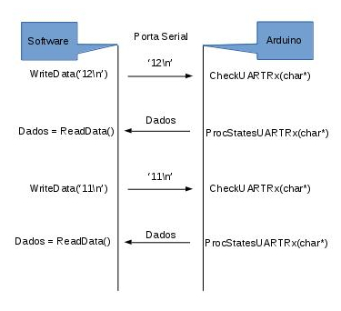
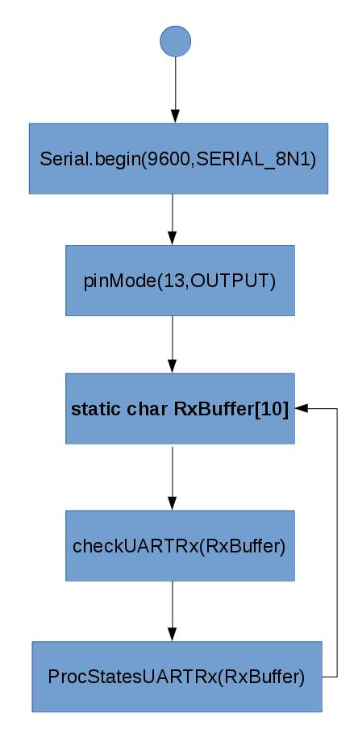
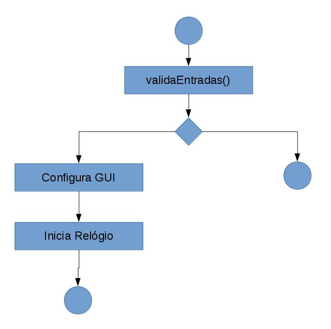

# maroloDAQ

O objetivo deste projeto é criar um sistema de medição assistida por computador com dois componentes interconectados: Arduino e Software.

A comunicação entre eles ocorre por meio de portas seriais e de cabo USB. Ela é bidirecional, permitindo que ambos recebam e transmitam comandos ou dados entre si.

O Arduino é um micro-controlador com uma plataforma de execução embutida. Ele é utilizado, para medir a tensão elétrica em um sensor, que é fixado ao objeto da medida, e transmiti-la ao Software.

O Software, desenvolvido com o framework Qt, configura os parâmetros de sensoriamento (erro, intervalo de amostragem e tempo de captura), transforma a tensão em valores úteis e armazena os dados.

## Compilar e Executar:

<ol>
<li>Instale as dependência para compilar programas com QT 5 e QSerial</li>
<li>clone o repositorio: git clone https://github.com/jemartins/maroloDAQ</li>
<li>cd maroloDAQ.v????</li>
<li>qmake</li>
<li>make</li>
<li>./maroloDAQ</li>
</ol>
